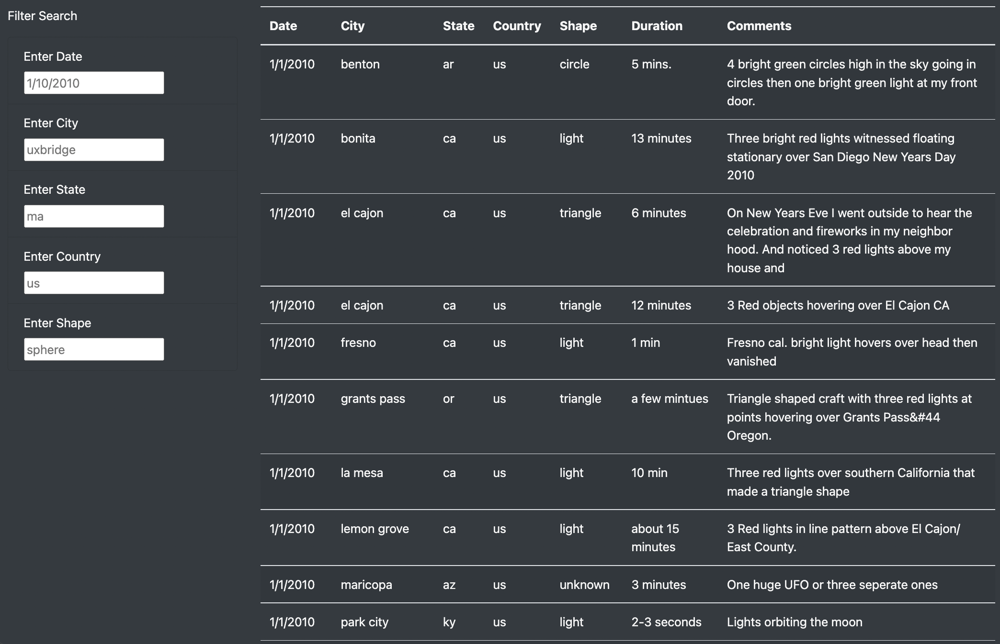
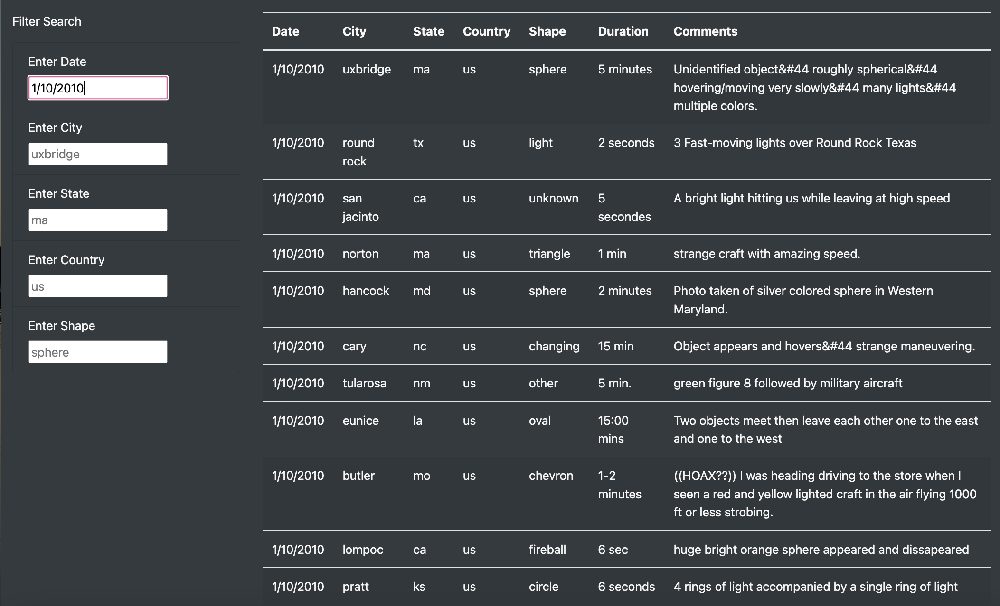
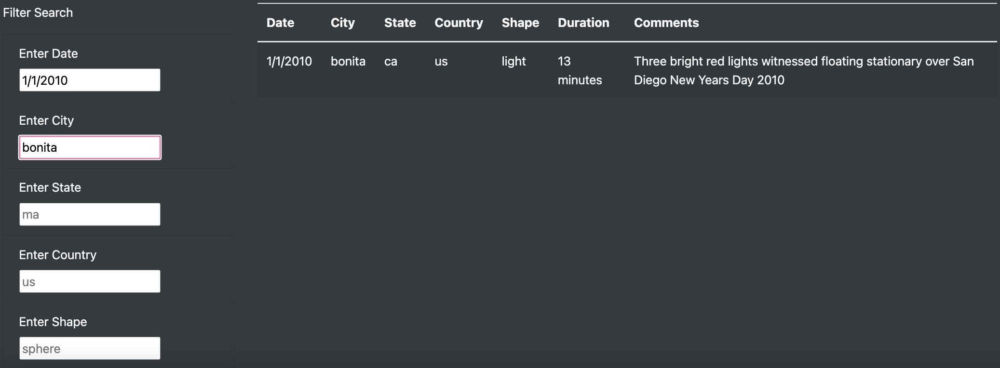
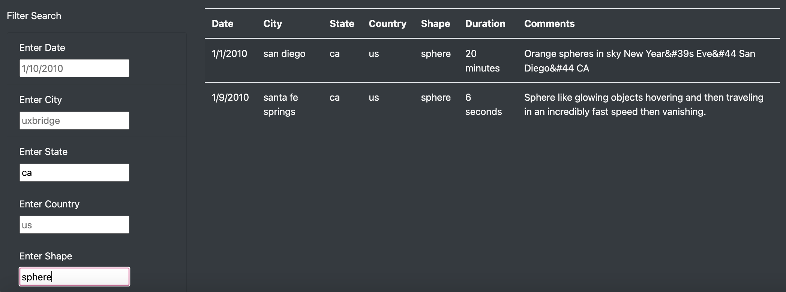
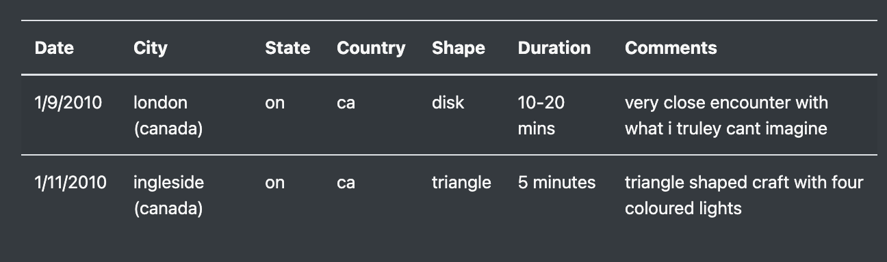

# UFOs with Javascript and HTML

## Overview of the Analysis
Dana is a data journalist who is at a point in her career where she has the freedom to choose the topics she wants to write about. She had the opportunity to write about UFO sightings. Her UFOs sighting data is found in the [data](js/data.js) file. She has asked for help to use Javascript to display the data, manipulate teh data through filters, and put everything together in a tidy HTML page. 

In the initial analysis, an HTML page was created with an option to filter by date using a input box and filter button. For information on how this was done please see the following documents: 
* [index_initial](index_initial.html)
* [app_initial](js/app_initial.js)
* [style.css](static/css/style.css)

Dana’s webpage and dynamic table are working as intended, but now she’d like to provide a more in-depth analysis of UFO sightings by allowing users to filter for multiple criteria at the same time. In addition to the date, the purpose of this project is to add table filters for the city, state, country, and shape.

## Analysis Process 

Used JavaScript and HTML, to modify the code in the 
index.html file to create more table filters to add filters for the city, state, country, and shape. 

Used JavaScript, to replace the `handleClick()` function in the app.js file with a new function `updateFilters()` that saves the element, value, and id of the filter that was changed. Then created a new function `filterTable()` to loop through the dataset and keep only the results that match the search criteria. The webpage will be updated with the search criteria after pressing "Enter".

For more information on how this was done, please see the following files: 
* [index](index.html)
* [app](js/app.js)
* [style.css](static/css/style.css)

## Results
In order for users to use the filters, the must first navigate to the html page in their browser and scroll down to the table, which has the filter input boxes on the left hand side as shown below.

There are five options the user can filter for, in combination or individually:
* Date of the sighting
* City of the sighting 
* State of the sighting
* Country of the sighting
* Shape of the UFO sighting 

As shown in the image above, there are pre-populated examples of what the user can filter by, and the notation of how the filter should be entered:
* Date filter must be inputted in m/dd/yyyy format
* City filter must be inputted as the full city name, all letters must be in lower case 
* State filter must be provided with lower-case 2-letter state code / abbreviation
* Country filter must be provided with lower-case 2-letter country code / abbreviation 
* Shape filter must be provided in lower-case 

The user may input one filter if desired by typing in the filter and pressing the "Enter" key on their keyboard. An example is shown below for a filter for date, where the filtered date is 1/10/2010.

As shown above, the table will filter for all UFO sightings that were seen on 1/10/2010.

The user may also input multiple filters by typing in all their desired filters into the input fields and pressing the "Enter" key on their keyboard. Some examples of multiple filters are shown below.

Date & City

In the image above, the table was filtered for the date 1/10/2010 and the city was Bonita.

State & Shape

In the image above, the table was filtered for the state "ca" (California) and the shape of the UFO - "sphere". The table returned all matching results.

If the user inputs the desired filter in correctly, or if there are no sightings for the specified filter, the table will return nothing. To enter additional filters after the table shows nothing, the user will need to refresh the page by either clicking on the "UFO Sightings" text at the very top of the page, or by clicking on the refresh button in the browser. 

If the user would like to go back to all table data, 
the user will need to refresh the page using one of the methods noted above.

It is important to note that if a user were to input more than one filter (for example, date and city) but would after want to only filter for one of the options (now the user only wants to filter for date and not city) the user will need to refresh the page with one of the methods noted above and enter the filter. 

## Summary 

### Drawbacks
The new HTML page is a great way for users to have a more in-depth analysis by being able to filter for multiple criteria at the same time. However, there are a few drawbacks to the design:

1. The filter criteria must be inputted correctly or else no data will show. For example, if looking up sightings in Canada, if the user would also like to filter by city they would need to input "(canada)" after the city name, as shown below. However, this may not be inuitive for the user. They may just assume there are no sightings in the City.

2. The user will need to refresh the page if there are no results for the search, or if they would like to go back from using multiple filters to just one filter. 

3. The webpage does not explain a lot about what the data entails. For example:
* what is the period utilized for the data for example is it 2010 to present? 
* Is the data provided on a global scale? Or is it just sightings in North America?
This would be important for the user to know so that they don't have to keep refreshing the page when there are no results shown! 

### Recommendations for Further Development 
To address some of the drawbacks noted above, a few suggestions to improve the page are: 

1. Provide descriptors for the filters to demonstrate the specific constraints on how the filter must be entered. For example: "please provide all inputs in lower case"

2. Perhaps re-work the code in the app.js file, so that the table will be more dynamic in updating all filters after various sequences of filtering. For example, the table should still filter after there are no results for a particular filter, or the table should be able to filter for just one filter input after using multiple filter inputs. Alternatively, the refresh button could be moved from "UFO Sightings" at the top of the page, to right below the filter inputs to make it easier for the user to refresh the page. 

3. Provide descriptors of what the data in the table entails (what length of time is included in the data, is this on a gobal scale or a specific continent/region, etc.)

4. It would also nice to have a notification when no reults appear for certain filters. For example: "No results. Please refresh the page and start again." There should also be instructions for the user on when refreshes are needed (if the suggestion in item 2 cannot be done).

